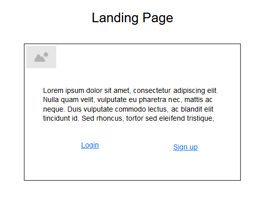
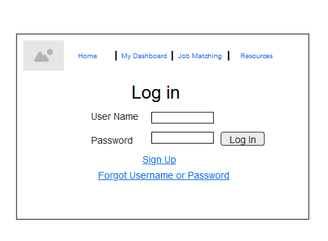
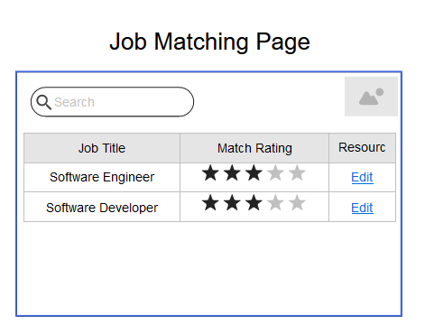

# Project Planning
For this assignment, you'll create some initial plans for your project.

## Assignment Description
[Project Planning Assignment](https://education.launchcode.org/liftoff/modules/assignments/project-planning)

## Submission Instructions

### Wireframes
- Landing Page:

- Login Page:

- Job Matching Page:

### Project Tracker

https://trello.com/b/KNuSS8qN/other-project

Include a link to your public Trello board. Be sure you have user stories added for at least your first 2-week sprint.

### Project Repo Link

https://github.com/jaydubbs44/job-match

Include a link to your project on GitHub.
